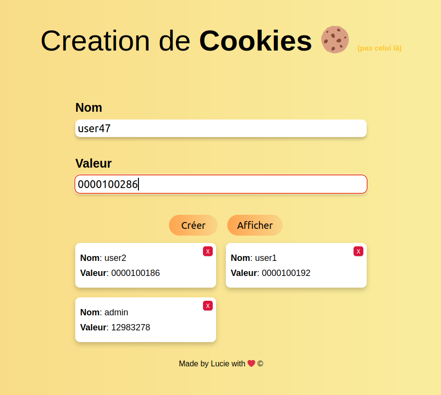

# CRÉATION DE COOKIES

J'ai codé une app web qui crée des cookies en javascript natif.

On peut créer des cookies, les modifier, les supprimer et les afficher dans l'ordre de création.

Les cookies sont accessibles via l'onglet stockage de votre navigateur.

